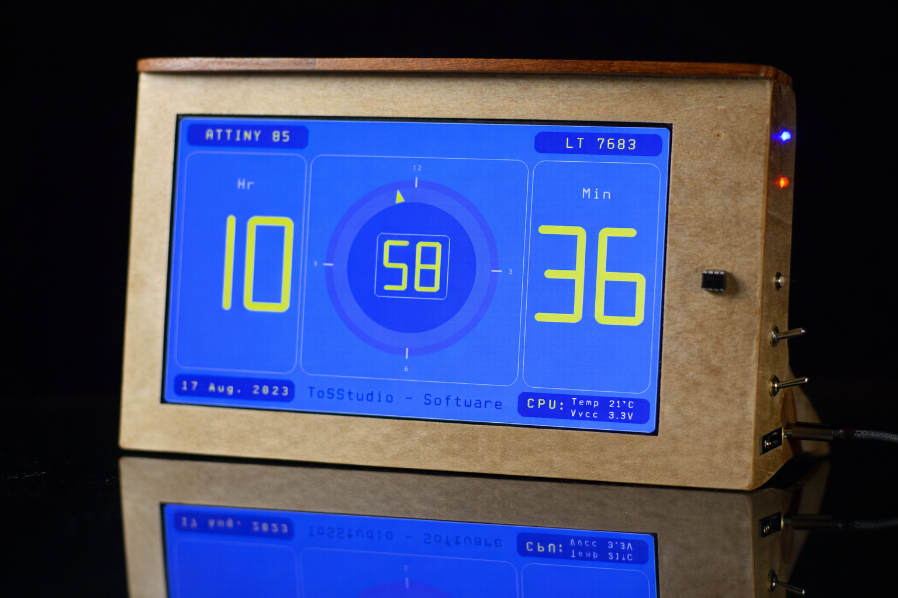
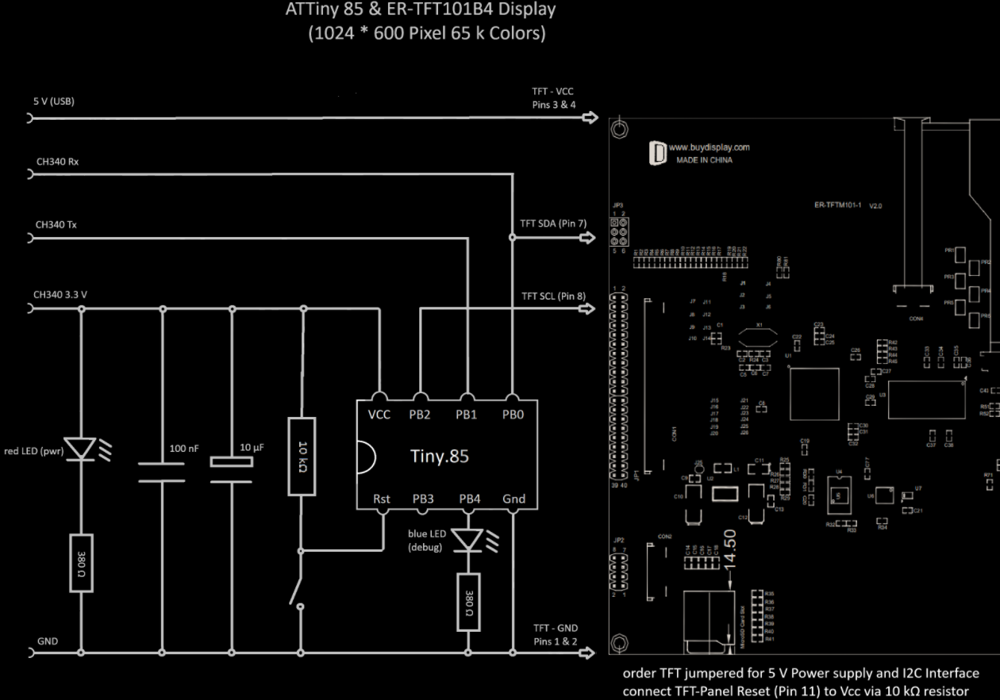

# TinyTFT_LT7683

Driving a 10″ 1024×600 TFT display using an ATTiny85 over I²C.

## Overview

This project demonstrates that even a very small 8-bit microcontroller,
the **ATTiny85**, is capable of controlling a large **LT7683-based TFT display
(1024×600 pixels, 65k colors)** over a simple **I²C interface**.

The intent is not high-speed graphics or video playback, but efficient
control of a powerful display controller for **user interfaces, meters,
status panels, and dashboards**, using minimal hardware resources.

The project started as an experiment to see how far a tiny microcontroller
could be pushed when paired with a capable display controller.
Surprisingly, it works reliably — even with a 10″ display.

---

## Key Characteristics

- ATTiny85 (8 KB Flash, 512 B RAM)
- LT7683 graphics controller (I²C mode)
- No external RAM or framebuffer
- No SPI or parallel bus
- Very low pin count
- Typical firmware size: ~3.5 KB
- Suitable for static or moderately dynamic UIs

---

## Hardware Setup

### Notes

- The ATTiny85 runs at **3.3 V**
- The TFT module is powered from **5 V**, but all logic signals are **3.3 V**
- I²C pull-up resistors are present on the TFT board (to 3.3 V)
- PB0 is shared between UART TX (CH340) and I²C SDA
- No bus conflicts were observed in practice

This diagram shows signal intent and support components;
it is **not a full schematic**.

---

## Software

- ATTiny85 with bootloader
- Bit-banged I²C implementation using the Tiny85 USI
- Vendor-defined LT7683 I²C command protocol
- No frame buffer on the microcontroller

The software focuses on **command-level control** of the LT7683 rather than
pixel streaming.

---

## What This Is (and Is Not)

**This project is:**
- A proof of concept
- A reference design for minimal UI controllers
- A demonstration of architectural limits

**This project is not:**
- A video display solution
- A high-frame-rate graphics system
- A drop-in replacement for SPI or RGB TFTs

---

## Demo Applications

Current demos include:
- Basic graphics primitives
- UI elements and status panels

Additional demos may be added over time.

---

## Limitations

- I²C bandwidth limits full-screen updates
- Animation must be used sparingly
- Complex scenes require careful design

These limitations are accepted by design.

---

## Future Work

- Plug-on adapter board for cleaner wiring
- Additional demo applications
- Integration into the WindOino project

---

## License

MIT License — see `LICENSE` file for details.

---

> Developed by ToSStudio (Berlin, Germany)  
> “Big displays on tiny chips.”
