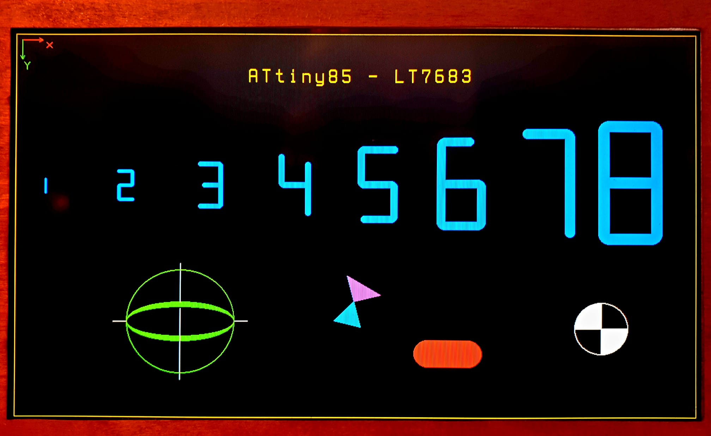

# Basic Test Screen

*Static diagnostic screen showing coordinate system, text scaling, and drawing primitives.*

This example provides a **static diagnostic test screen** for the
**LT7683 graphics controller**, driven by an **ATtiny85 over I²C**.

It is intended as the **first sketch to run** after wiring the display,
to verify correct operation before trying animated demos.

## Purpose

The Basic Test Screen demonstrates and validates:

- full screen resolution and clipping
- coordinate system and axis orientation
- text rendering and scaling
- graphic primitives provided by the LT7683 drawing engine
- color handling and fill modes

No animation is used; the display contents remain static.

## What Is Shown

The screen includes the following elements:

- **Outer frame**  
  Confirms screen size, orientation, and drawing limits.

- **X/Y origin indicator (top-left)**  
  Shows the coordinate origin `(0,0)` and axis directions:
  - red arrow → +X
  - green arrow → +Y

- **Text scaling demonstration**  
  The digits `1 … 8` are rendered at increasing sizes to show
  font scaling and readability.

- **Graphic primitives**
  - circle and arc
  - filled and outlined shapes
  - rounded rectangle
  - triangle / polygon
  - crosshair and symmetry test

Each primitive is positioned to avoid overlap and to clearly demonstrate
its geometry.

## Hardware / Software Notes

- Target: **ATtiny85 @ 8 MHz**
- Interface: **I²C Fast Mode (400 kHz)**
- No framebuffer and no external RAM are used
- All drawing is performed by the LT7683 hardware engine

## Usage

1. Flash this sketch to the ATtiny85.
2. Power the TFT display and microcontroller.
3. Verify that all elements appear correctly and are properly aligned.

If this sketch works as expected, the wiring and basic configuration
are known to be correct, and other examples can be run safely.

## Why This Matters

Large TFT displays can be unforgiving when wiring or configuration
is slightly wrong. This test screen provides a quick and unambiguous
way to confirm that the display controller, communication, and geometry
are all functioning correctly before moving on to more complex demos.
